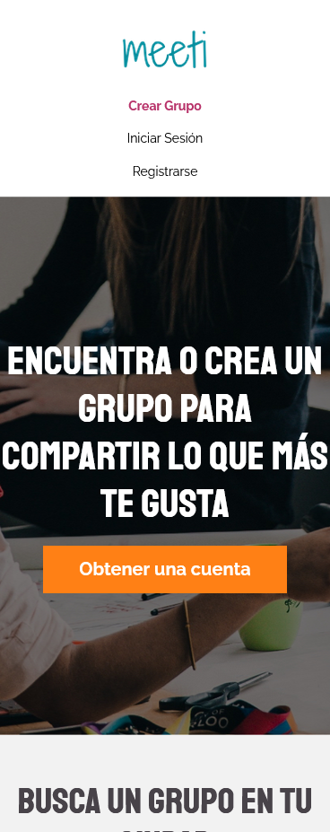
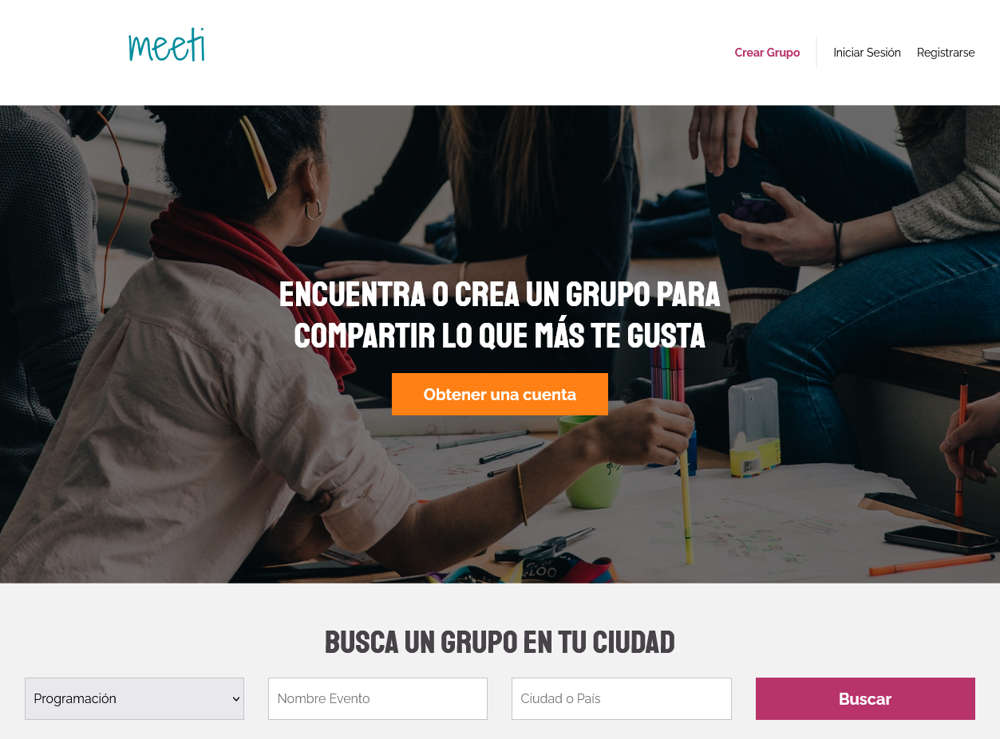

# Clon de Meetup

Sitio web Responsive con enfoque Mobile First usando SCSS junto a la metodología BEM para el frontend 

## Tabla de contenidos

- Clon de Meetup
  - [Vista Previa](#vista-previa)
    - [Screenshot](#screenshot)
    - [Link](#link)
  - [Mi Proceso](#mi-proceso)
    - [Construido con:](#construido-con)
  - [Author](#author)

## Vista Previa

### Screenshot
Mobile screenshot

Desktop screenshot

### Link

- Live Site URL: [https://vmnunez.github.io/Clon-Meetup-Vite/](https://vmnunez.github.io/Clon-Meetup-Vite/)

## Mi Proceso

### Construido con:

- HTML5 
- SCSS
- Flexbox
- Mobile-first workflow

## Autor
Víctor Manuel Núñez Pradas
